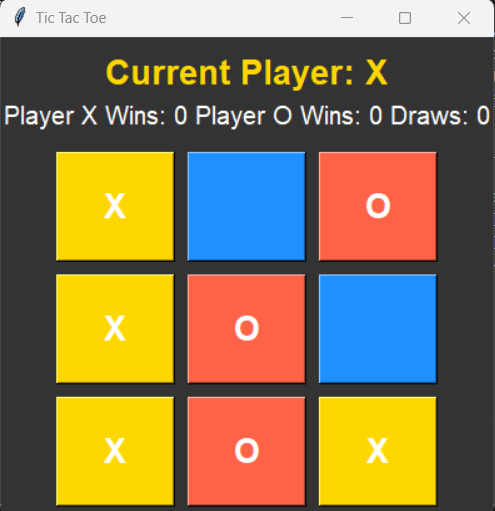

# Tic Tac Toe Game

This is a simple Tic Tac Toe game implemented in Python using the `tkinter` library. The game features a graphical interface, displays whose turn it is, and keeps track of wins and draws.

## Installation and Setup

1. Clone the repository:
    ```sh
    git clone https://github.com/yourusername/TicTacToeGame.git
    cd TicTacToeGame
    ```

2. Create a virtual environment and activate it:
    ```sh
    python -m venv venv
    source venv/bin/activate  # On Windows, use `venv\Scripts\activate`
    ```

3. Install the required dependencies:
    ```sh
    pip install -r requirements.txt
    ```

4. Run the game:
    ```sh
    python main.py
    ```

## Gameplay

- Player X always goes first.
- Players take turns to place their mark (X or O) on the board.
- The game ends when a player wins or there is a draw.
- The game displays the current player's turn and keeps track of the number of wins for each player and the number of draws.

## Screenshots



